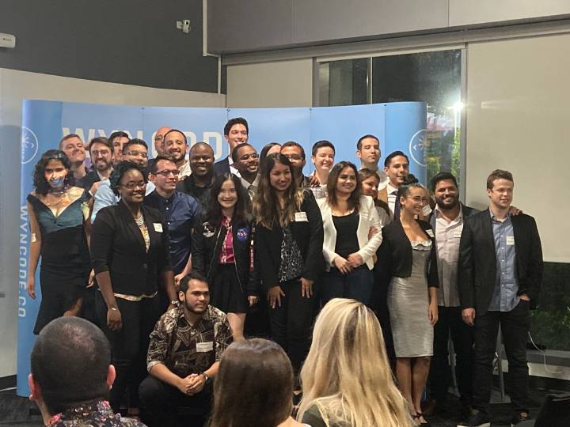

Hello world. My name is James Kemp and I'm a full stack developer from Miami, FL. I graduated from [Wyncode Academy](https://wyncode.co/) last December. I went from 0 to hero in HTML, CSS, JavaScript, ReactJS, Ruby on Rails, Postgres and a plethora of other technologies.

## So much to learn and so excitement to learn!

Coming out of wyncode, I've never felt more confident in my abilities but also so aware of what I don't know. I'm so excited to jump into new technologies like:

- Express.js
- MongoDB
- GatsbyJS (hello gatsby!)
- GraphQL

But first I want to master what I've already begun learning. React is a beautiful libray, and JSX is heavenly to write, but there's a lot of awesome react technology that I don't currently know. Hooks, Context, Reducer are just some of the things I can't wait to master in 2020.

### The year of the rat is my year to grow

Yes, **2020** is the [year of the rat](https://chinesenewyear.net/zodiac/rat/), and yes this will be my year to grow more than I ever have in my short 23 years on this Earth. I'll come back to this post in 100 and 365 days from now to look back and be so proud of what I've been able to do, just you wait!
